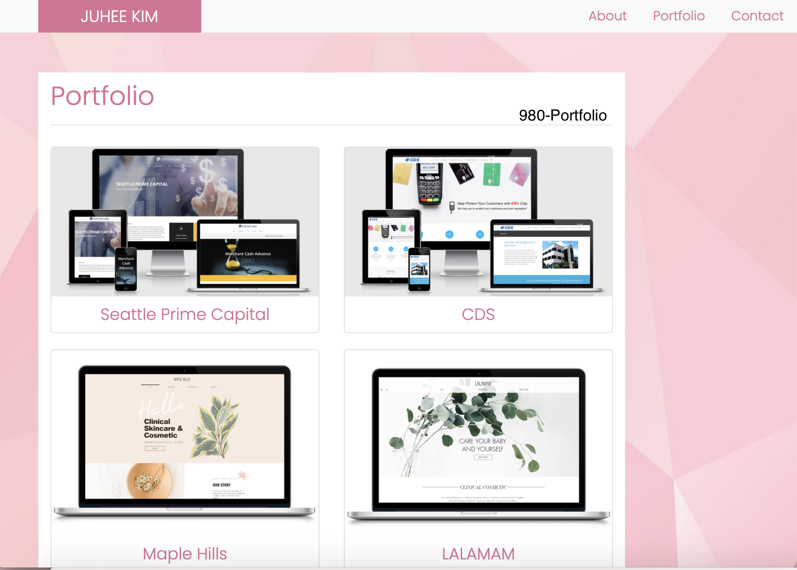
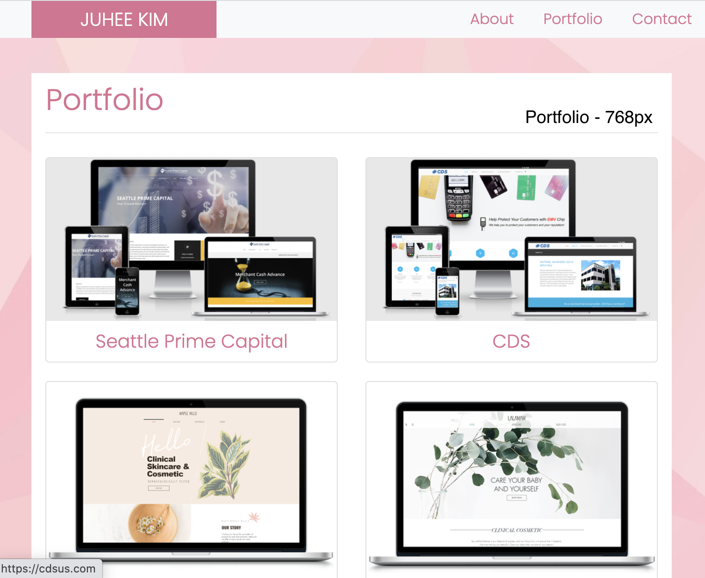
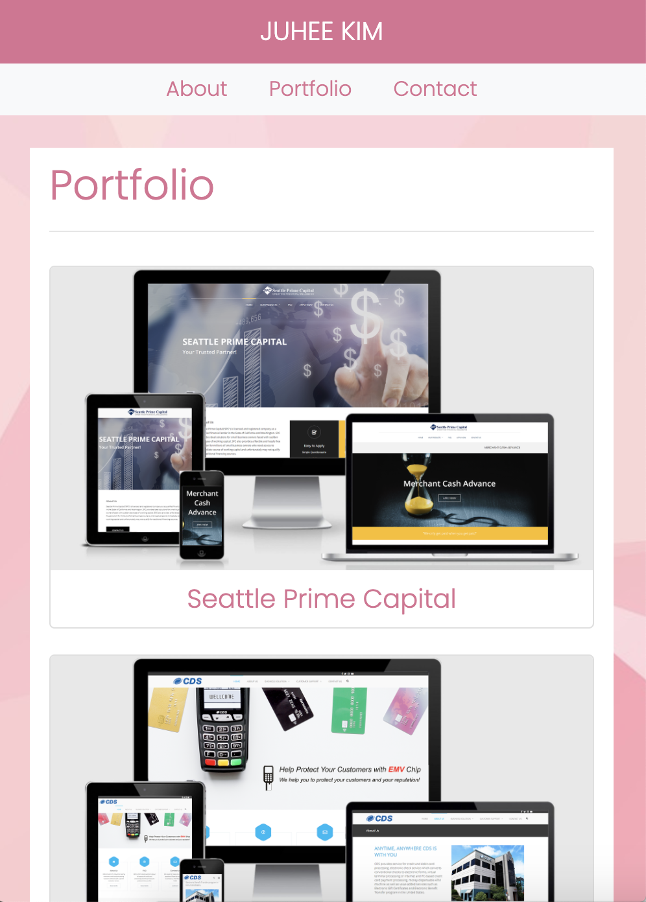

# My Portfolio
I have been working as an associate product manager and web editor. My portfolio site has the sites that I have built with html & css, Wordpress, Wix, Duda and as well as the brochure, flyer, buisess cards that were created by using Adobe Illustrator and Photoshop. I have done more than portfolios and pretty sure that I will make more and better! 

## Link
Please visit [My Portfolio](https://juhee-k.github.io/myportfolio/portfolio.html) site!

## Screenshots

## Built with
- [HTML](https://developer.mozilla.org/en-US/docs/Web/HTML)
- [CSS](https://developer.mozilla.org/en-US/docs/Web/CSS)
- [Bootstrap](https://getbootstrap.com/)
- [Google Fonts](https://fonts.google.com/)

